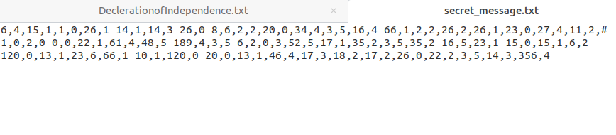

# CipherTextEncryption
An encrytption program that takes a cipher text and encodes secret messages to a file. The secret message text is encoded using the cordinates of letters in the cipher text to replace the characters of the entered message. The program handles decryption as well.

## How to run
The repository contains an executable file but if desired, it may be compiled with the commands gcc encrypt_cipher_text.c -Wall -o encrypt_cipher_text and an executable will be produced. To run the program, enter ./encrypt_cipher_text in the command  line interface of your system to begin the program and you should see the option screen.

Before a secret message may be entered, the filename of the cipher text used to generate the encryption must be entered first. This can be done by choosing option of the menu screen however, options two or three will forcefully ask for cipher text.

Option two allows the user to enter the secret message and the filename for the encoded text to later be decrypted. The encrytped message will look simmilar to the following message.

Option three will decrypt the message however, non-alphabetic characters will be represented by #

##Dependencies
gcc must be installed to run the program.
